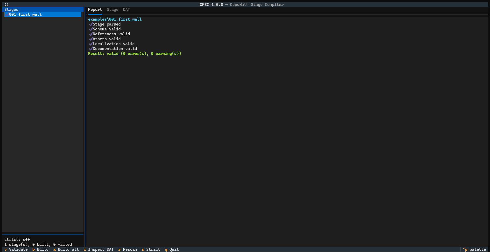
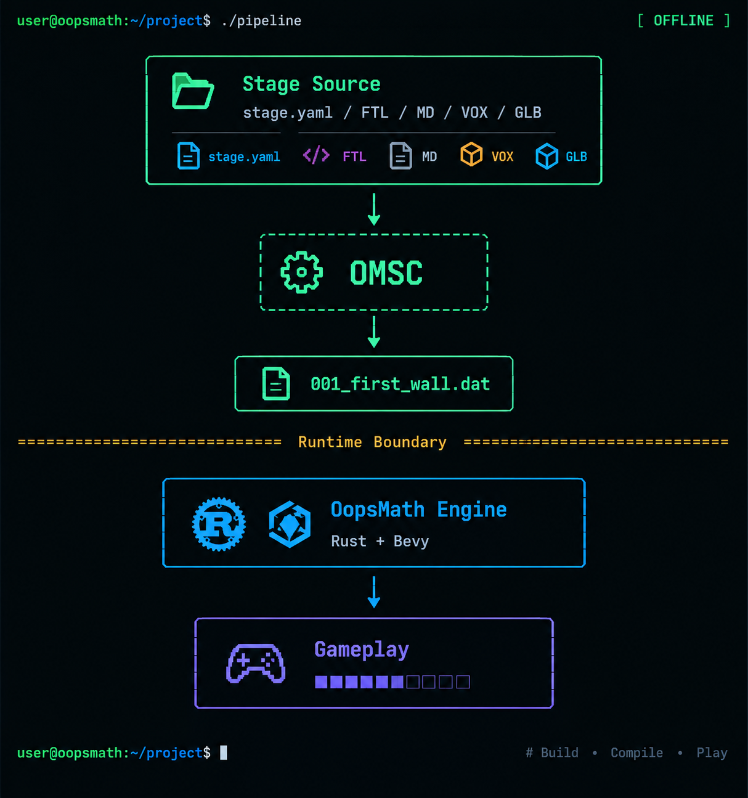

# OopsMath Stage Compiler (OMSC)

**DAT v1 · Stage Schema v1 · Compiler 1.0.0**

OopsMath Stage Compiler (**OMSC**) is the offline content compiler for **OopsMath**.

It converts a stage source directory containing `stage.yaml` and optional supporting files into a single deterministic `.dat` runtime package.

```text
Stage Source
    │
    ├── stage.yaml
    ├── localization/*.ftl
    ├── *.md
    ├── *.vox
    └── assets/*.glb
            │
            ▼
      OMSC Validation
            │
            ▼
      Normalization
            │
            ▼
       DAT Packaging
            │
            ▼
     Deterministic .dat
```

> **Important:** OMSC is a compiler and packaging tool, not the OopsMath game runtime.
>
> OMSC validates source structure, schemas, references, files, and package integrity. It does **not** simulate gameplay, construction, physics, objectives, scoring, or runtime conditions.

---

## Features

* Stage Schema v1 validation, YAML parsing with duplicate-key and alias-bomb protection
* Reference validation (tasks, targets, tests, conditions, stage IDs, registries)
* Built-in asset/block/tool/audio manifest validation
* Fluent (`.ftl`) localization validation
* Markdown documentation packaging
* MagicaVoxel (`.vox`) import with scene-graph flattening and Z-up → Y-up conversion
* Custom voxel world encoding (dense / RLE chunks)
* GLB custom-asset validation and packaging
* MessagePack serialization, Zstandard compression, CRC32 integrity checks
* Deterministic `.dat` generation, self-verified before it is written
* DAT inspection and section dumping
* Multi-stage builds
* **Coloured CLI** with summaries, quiet mode and JSON output for CI
* **Interactive TUI** to browse, validate, build and inspect stages
* **`omsc new`** to scaffold a valid starter stage
* Built-in self-tests plus a pytest suite

---

# Requirements

* Python 3.9+
* [PyYAML](https://pypi.org/project/PyYAML/), [jsonschema](https://pypi.org/project/jsonschema/), [msgpack](https://pypi.org/project/msgpack/), [zstandard](https://pypi.org/project/zstandard/), [textual](https://pypi.org/project/textual/)


```bash
pip install -r requirements.txt          # compiler only
```

Without installing, every example below also works as `python omsc.py ...` or `python -m oopsmath_stage ...`.

---

# Repository Structure

```text
OOPSMATH-STAGE-COMPILER/
│
├── omsc.py                    # launcher: python omsc.py <command>
├── README.md
├── pyproject.toml
├── requirements.txt
├── stage.schema.yaml          # Readable Stage Schema v1
│
├── oopsmath_stage/            # the compiler package
│   ├── cli.py                 # argument parsing, commands, output
│   ├── tui.py                 # Textual interface
│   ├── workflow.py            # build/validate operations shared by CLI and TUI
│   ├── ui.py                  # colour / table helpers
│   ├── scaffold.py            # `omsc new`
│   │
│   ├── constants.py           # DAT/WRLD layout constants
│   ├── errors.py              # exceptions, Diagnostics
│   ├── util.py                # CRC32, alignment, MessagePack, Zstandard
│   ├── dat.py                 # DAT writer, reader, atomic file output
│   ├── world.py               # WRLD encoder / decoder
│   ├── vox.py                 # MagicaVoxel parser
│   ├── ftl.py                 # Fluent syntax validator
│   ├── yamlio.py              # safe YAML loading
│   ├── paths.py               # safe relative paths
│   ├── registry.py            # manifest, base locales, CompileOptions
│   ├── schema.py              # embedded Stage Schema v1
│   ├── model.py               # StageSource / ValidationResult
│   ├── compiler.py            # source -> sections -> DAT
│   ├── selftest.py            # built-in self tests
│   └── validation/
│       ├── schema_check.py    # layer 2: JSON Schema
│       ├── references.py      # layer 3: references and conditions
│       ├── files.py           # layer 4: GLB, VOX world, Markdown
│       ├── localization.py    # layer 4: FTL and key references
│       └── driver.py          # runs all layers
│
├── examples/
│   └── 001_first_wall/
│       ├── stage.yaml
│       ├── lesson.md
│       ├── solution.md
│       └── localization/
│           ├── fa.ftl
│           └── en-US.ftl
│
└── tests/
```

---

# CLI Usage

```text
omsc [--version] [--no-color] COMMAND ...

COMMAND:
  validate     validate a stage (or every stage under a directory)
  build        validate and compile one stage
  build-all    discover and compile every stage under a directory
  inspect      inspect a DAT file
  new          create a starter stage directory
  tui          open the interactive terminal UI
  self-test    run the built-in self tests
```

Colour is used automatically on terminals. It is disabled when output is piped, when `NO_COLOR` is set, or with `--no-color`.

## Create a Stage

```bash
python omsc.py new stages/002_second_wall
python omsc.py new stages/002_second_wall --id 002_second_wall
```

Writes `stage.yaml`, `lesson.md` and `localization/{en-US,fa}.ftl`. The starter stage passes `validate --strict` out of the box.

## Validate a Stage

```bash
python omsc.py validate examples/001_first_wall
```

```text
✔ Stage parsed
✔ Schema valid
✔ References valid
✔ Assets valid
✔ Localization valid
✔ Documentation valid
Result: valid (0 error(s), 0 warning(s))
```

* Point it at a directory of stages to validate all of them: `omsc validate examples`
* `-q / --quiet` prints only warnings and errors
* `--format json` prints one machine-readable report (a list when several stages are validated):

```json
{
  "stage_dir": "examples/001_first_wall",
  "stage_id": "001_first_wall",
  "ok": true,
  "passed": ["Stage parsed", "..."],
  "errors": [],
  "warnings": []
}
```

## Build a Stage

```bash
python omsc.py build examples/001_first_wall
python omsc.py build examples/001_first_wall -o build/001.dat
python omsc.py build examples/001_first_wall -o build/        # -> build/001_first_wall.dat
```

```text
✔ Stage compiled
Output: build/001.dat  (1.5 KiB)
```

`--debug` sets the `DEBUG_BUILD` header flag.

## Build All Stages

```bash
python omsc.py build-all examples --output-dir build/stages
```

Each stage is compiled independently to `<output-dir>/<stage_id>.dat`. The output directory is created if needed. Stages that share a stage ID are reported and skipped. A final line summarises the run (`Built 3 of 4 stage(s); 1 failed.`).

## Inspect a DAT Package

```bash
python omsc.py inspect build/001.dat
python omsc.py inspect build/001.dat --dump STAG
```

Prints the header, a section table (offset, stored/raw size, compression, flags, CRC32, status) and, with `--dump`, the decoded content of one section. Sections: `META`, `STAG`, `WRLD`, `LOCL`, `DOCS`, `ASIX` (decoded) and `ASDT` (raw bytes). Corrupt sections are highlighted and the exit code is `2`.

## Run Self-Test

```bash
python omsc.py self-test        # built-in suite
python -m pytest                # same tests + CLI tests (needs pytest)
```

---

# Terminal UI

```bash
python omsc.py tui examples                       # browse stages under ./examples
python omsc.py tui stages --output-dir build --strict --manifest config/manifest.yaml
```




| Key | Action |
| :-: | ------ |
| `↑` `↓` | choose a stage (it is validated automatically) |
| `v` | re-validate the selected stage |
| `b` | build the selected stage into `--output-dir` (default `build/`) |
| `a` | build every listed stage |
| `i` | jump to the **DAT** tab for the selected stage's package |
| `r` | rescan the directory for stages |
| `s` | toggle strict mode (warnings become errors) |
| `q` | quit |

Stage status icons: `○` not checked · `✔` valid · `✘` errors · `●` built.

Tabs: **Report** (diagnostics), **Stage** (summary of the validated stage), **DAT** (header info, section list and a decoded view of the highlighted section). Work runs in a background thread, so large VOX files do not freeze the interface.

---

# Common Options

## `--manifest FILE`

Built-in OopsMath registry in JSON or YAML:

```yaml
blocks: [brick, wood, stone, concrete]
tools: [hammer, tape_measure]
assets: []
audio: []
```

Stage references are verified against these IDs. Built-in resources are referenced by stable IDs and are **not embedded into the stage package**. A category that is omitted is simply not validated.

## `--base-locales DIR`

Global game localization directory (`*.ftl`). It is conceptually separate from stage-local localization.

## `--strict`

Treat compiler warnings as errors. Recommended for CI and release builds.

Available on `validate`, `build`, `build-all` and `tui`.

---

# Stage Source Format

A minimal stage can consist of only a YAML file; every other file is optional.

```text
001_example/
├── stage.yaml
├── lesson.md
├── solution.md
├── localization/
│   ├── fa.ftl
│   └── en-US.ftl
├── world.vox
└── assets/
    └── special_beam.glb
```

Every stage starts with `schema_version: 1`. OMSC validates the **structure and references** of the declarations; it does not execute them. For example, a `physics.tests` entry is checked for structure, while the simulation itself belongs to the OopsMath runtime.

---

# Localization

```text
localization/
├── fa.ftl
└── en-US.ftl
```

```yaml
localization:
  ftl: "localization"
  namespace: "stage.001"
```

`ftl` is a **directory path**; locale names come from file names (`fa.ftl` → `fa`). A referenced key must exist in the base locale registry (`--base-locales`) or in the stage FTL files. If neither exists the keys cannot be verified, so a single warning is emitted instead of errors (an error with `--strict`).

FTL keys may contain dots (`stage.001.title`), an OopsMath extension to strict Fluent identifiers.

---

# Documentation

Markdown files referenced from `learning` (`lesson`, `solution`, `hints`) are packaged into the `DOCS` section, so the runtime never needs the original files.

---

# DAT v1

OopsMath stages are stored in a custom binary container:

```text
┌─────────────────────────────────────────┐
│ DAT Header                 (64 bytes)   │
├─────────────────────────────────────────┤
│ Section Directory          (48 B/entry) │
├─────────────────────────────────────────┤
│ META  · STAG  · WRLD  · LOCL            │
│ DOCS  · ASIX  · ASDT                    │
└─────────────────────────────────────────┘
```

* All integers little-endian; each section starts on a 16-byte boundary
* Structured sections use MessagePack with sorted keys
* Compressible sections use Zstandard only when it makes them strictly smaller; `ASDT` stays raw so `ASIX` offsets address GLB bytes directly
* `header_crc32` is computed over all 64 header bytes with the CRC field zeroed
* Every section has a CRC32 over its raw bytes (integrity, not authenticity)
* Unknown non-critical sections may be skipped by a runtime; unknown critical sections must be rejected

| Section | Content |
| ------- | ------- |
| `META`  | quick-identification metadata (stage ID, grades, locales, content SHA-256) |
| `STAG`  | compiled stage definition (not the original YAML) |
| `WRLD`  | compiled voxel world, bounds-local coordinates |
| `LOCL`  | stage-local FTL, UTF-8 per locale |
| `DOCS`  | embedded Markdown documents |
| `ASIX`  | custom asset index (ID, type, MIME, offset, size, SHA-256) |
| `ASDT`  | custom binary asset data (GLB) |

Only the sections a stage needs are included.

---

# World Conventions

* OopsMath is **Y-up**, MagicaVoxel is **Z-up**; VOX import converts `(x, y, z) → (x, z, y)`
* VOX pipeline: parse → flatten scene graph → apply transforms → convert axes → rebase to `(0,0,0)` → apply `world.source.offset` (default `world.bounds.origin`) → palette mapping → encode `WRLD`
* VOX colour indices `1..255` map to built-in blocks through `world.source.palette`, with optional `default_block`
* Coordinates in `stage.yaml` are **absolute**; `WRLD` stores `local = absolute - bounds.origin`
* Where both describe the same cell, **YAML blocks override VOX voxels**

---

# Built-in vs Custom Assets

Built-in resources (`brick`, `hammer`, ...) are referenced by stable ID and supplied by the game. Custom stage assets (for example `assets/special_beam.glb`) are validated and embedded in the `.dat`, with their metadata in `ASIX`.

---

# Validation Scope

OMSC validates the **stage package**, not gameplay state: YAML syntax, schema compliance, IDs, references, registries, file existence, safe relative paths, FTL, Markdown, GLB and VOX structure, package layout, section sizes, CRC32 and deterministic output. Unsafe source paths (absolute, `..`, symlink escapes) are rejected.

The runtime owns interaction, task execution, inventory, purchasing, construction validation, structural graphs, physics, objectives, completion/failure conditions, scoring and events. For example, OMSC can verify that a stage declares `structure_stable: true`; it never decides whether a player's structure is stable.

---

# Deterministic Builds

For identical source files, compiler version, configuration and manifest, the generated `.dat` is byte-for-byte identical. No timestamps, absolute paths or random identifiers are embedded.

```powershell
python omsc.py build examples/001_first_wall -o build/a.dat
python omsc.py build examples/001_first_wall -o build/b.dat
Get-FileHash build/a.dat -Algorithm SHA256
Get-FileHash build/b.dat -Algorithm SHA256
```

---

# Exit Codes

| Code | Meaning                            |
| ---: | ---------------------------------- |
|  `0` | Success                            |
|  `2` | Validation error or corrupt DAT    |
|  `3` | Invalid arguments or configuration |
|  `4` | I/O error / missing dependency     |
|  `5` | Binary write error                 |

---

# Compiler / Runtime Boundary


> This image was made with AI

The game runtime should consume compiled `.dat` packages rather than raw stage sources.

---

# Development

```bash
pip install -e ".[dev]"
python -m pytest
python omsc.py self-test
```

Layering (each module only imports from those above it): `constants → errors → util → dat / world / vox / ftl / paths → yamlio / registry / model → schema → validation → compiler → workflow → cli / tui`.

---

# License

This project is part of the OopsMath project.
